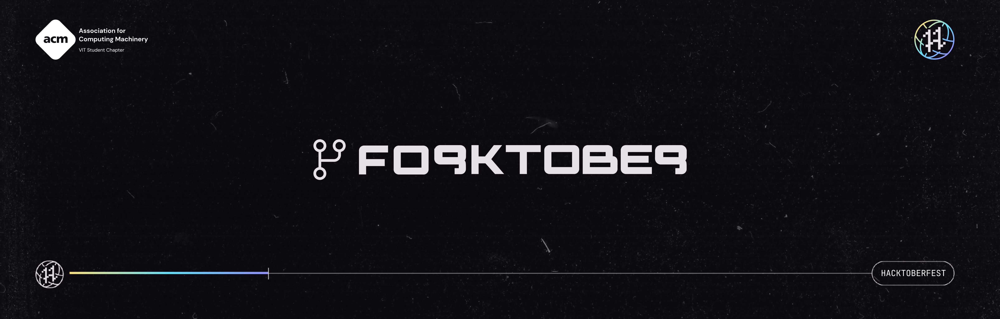

<h1 align="center"><a href="https://organize.mlh.io/participants/events/4390-kickstarting-hacktoberfest-with-acm-vit">Kicking Off Hacktoberfest with ACM-VIT!</a></h1>
<p align="center">

</p>

<h2 align="center"> MUSCLE MAGIC </h2>

<p align="center"> 
Muscle magic is an open source flutter application that handles and manages your workouts and exercises.
The app is written in dart.
</p>

<p align="center" >
  <a href="https://acmvit.in/" target="_blank">
    
  </a>
    <!-- Uncomment the below line to add the license badge. Make sure the right license badge is reflected. -->
    <!--  -->
    <!-- forks/stars/tech stack in the form of badges from https://shields.io/ -->
</p>

---
<p align="center">Project Status</p>

<p align = "center">
  
  
  
  
</p>

---
## Submitting a Pull Request

- Fork the repository by clicking the fork button on top right corner of the page
- Clone the target repository. To clone, click on the clone button and copy the https address. Then run
<pre><code>git clone [HTTPS-ADDRESS]</code></pre>
- Go to the cloned directory by running
<pre><code>cd [NAME-OF-REPO]</code></pre>
- Create a new branch. Use
<pre><code> git checkout -b [YOUR-BRANCH-NAME]</code></pre>
- Make your changes to the code. Add changes to your branch by using
<pre><code>git add .</code></pre>
- Commit the chanes by executing
<pre><code>git commit -m "your msg"</code></pre>
- Push to remote. To do this, run
<pre><code>git push origin [YOUR-BRANCH-NAME]</code></pre>
- Create a pull request. Go to the target repository and click on the "Compare & pull request" button. **Make sure your PR description mentions which issues you're solving.**

 </img>
- Wait for your request to be accepted.

---

## Guidelines for Pull Request

<!-- general guidelines here -->

- Avoid pull requests that :
  - are automated or scripted
  - that are plagarized from someone else's branch
- Do not spam
- Project maintainer's decision on validity of PR is final.

For additional guidelines, refer to [participation rules](https://hacktoberfest.digitalocean.com/details#rules)

---


  
---
## Overview

Muscle Magic is a simple exercise app made using flutter.The app allows you to train your body according to your preferred muscle group by selecting from a variety of workout plans for each muscle.It includes a progress tracker which helps you track your progress after each workout session.
It's not just an ordinary exercise app. It comes with cool extra features like:-

An enormous dataset of exercises that you can choose to your preference. <br>
A Stats section showing your workout stats and your body stats. <br>
Multiple workout plans for each week. <br>
A voice assistant that lets you log your sets with a voice command. <br>
Sharing your workout plans with friends and other people. <br>
See popular workout plans that other people are doing. <br>


---

## Usage

<!-- How To, Features, Installation etc. as subheadings in this section. example-->

Lets get started!

```console
git remote add
git fetch
git merge
```

---
## Authors


- [Harsh V](https://github.com/Harsh-Vipin)
- [Aryan C](https://github.com/AryanC19)
- [Agneya Anoop](https://github.com/AgneyaAnoop)

